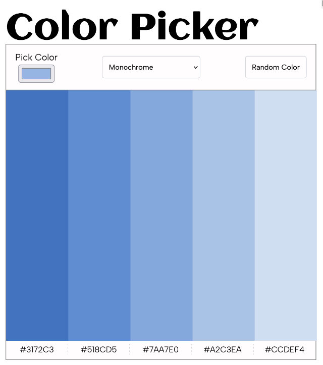

# Scrimba Solo Project - Color-Picker

## Live Version >> ➡️ [View Project](https://rapidisimo.github.io/Color-Picker/)

## Requirements
1. ✅ Choose "seed color" with an ```<input type="color />```
2. ✅ Choose color scheme mode in a ```<select>``` box
3. ✅ Clicking button makes request to "The Color API" to get a color scheme (I opted to save one click and make the request as soon as you choose a color or select a scheme.)
4. ✅ Display the scheme colors and hex values on the page

## Stretch Goals
1. ✅ Click on hex value or color and copy it to the clipboard

## Additions
1. 🌟 CSS Animations
2. 🌟 Random Color Button
3. 🌟 Copy to clipboard feedback in scheme and hex text area
4. 🌟 Mobile layout

## Preview
